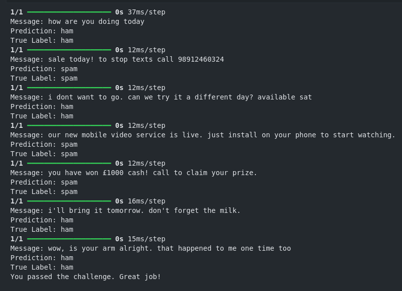

<h1> Neural Network SMS Text Classifier - ML Python Project</h1>
 
<h2>Features</h2>
<li>Create a machine learning model that will classify SMS messages as either "ham" or "spam". A "ham" message is a normal message sent by a friend. A "spam" message is an advertisement or a message sent by a company.</li>
<li>Make dataframe of dataset to see data from train and test</li>
<li>Rename the first column to 'label' and second column to 'text' and reverse the order</li>
<li>Split messages and labels from train data</li>
<li>Define regular expressions for emails, websites, and phone numbers</li>
<li>Spliting data into data and test data</li>
<li>Identify and replace emails, websites, and phone numbers with special tokens</li>
<li>Convert labels from text to numerical</li>
<li>Tokenize the text</li>
<li>Convert text to sequences (numerical)</li>
<li>Pad sequences to ensure uniform length</li>
<li>Build the model with additional features</li>
<li>Compile the model with ADAM optimizer</li>
<h2>Acknowledgments</h2>

<b> Python3: http://bit.ly/python3-certifications <b>
 

<h2>Photo</h2>

 

<h2>Links</h2>
<li>FreeCodeCamp Project: https://www.freecodecamp.org/learn/machine-learning-with-python/machine-learning-with-python-projects/neural-network-sms-text-classifier</li>
<h2>Contact</h2>

<b> Email: mariusc0023@gmail.com </b>
